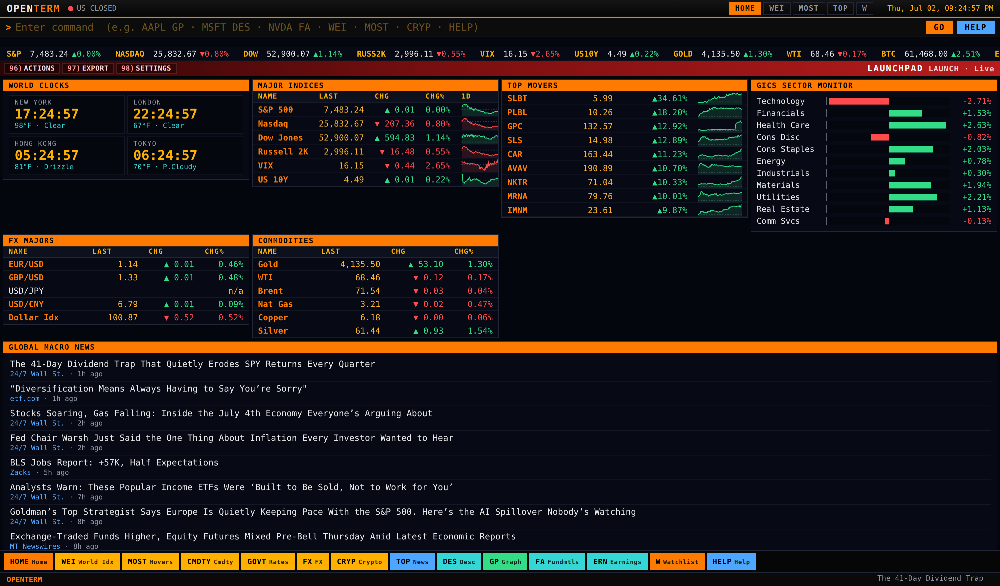
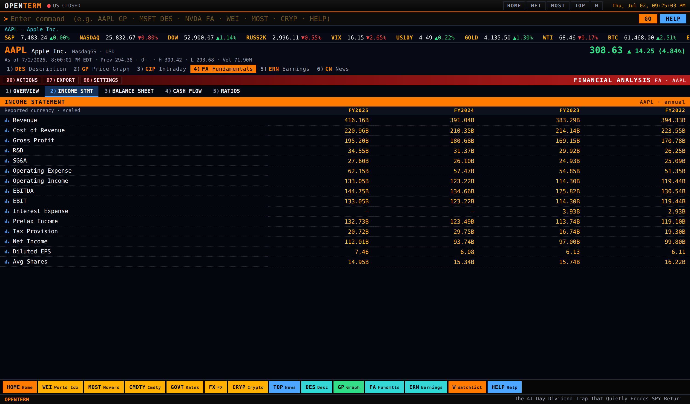
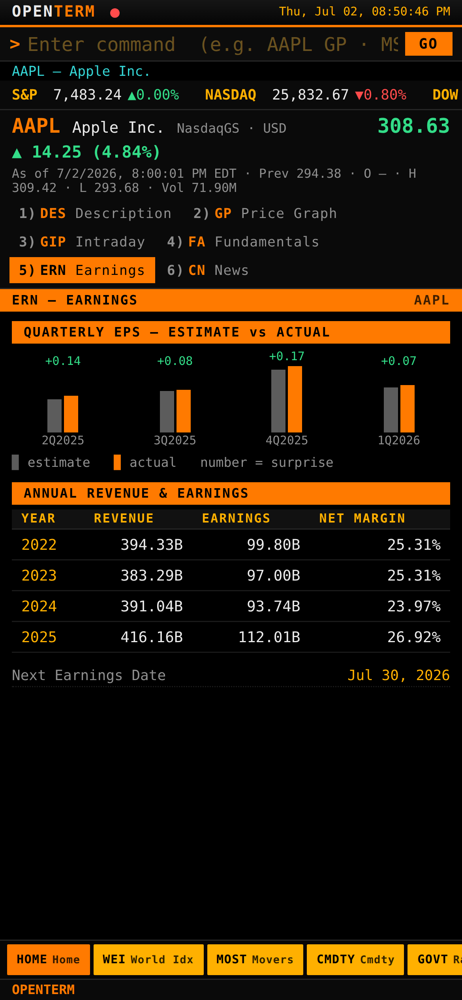

<div align="center">


### A Bloomberg-Terminal-style market terminal, powered entirely by free APIs.

Command-driven. Amber-on-black. Zero API keys required.
Type `AAPL FA` and hit `GO`.

[](https://nodejs.org)
[](#-deploy-to-cloudflare)
[](LICENSE)
[](#-data-sources)
[](#-quick-start)



</div>

---

## ⚡ Quick start

```bash
git clone https://github.com/TheJoeKD20/openterm.git
cd openterm
npm install
npm start           # → http://localhost:8432
```

No keys, no build step, no database. One `npm install` (`express` + `undici`) and you're live.

---

## 🎯 Why

Bloomberg charges ~$32,000/yr per terminal. This is a love letter to that
interface — the amber command line, red function bars, color-coded keyboard,
the Launchpad wall of data — wired up to **free market data**. It won't get you
Bloomberg's proprietary feeds (chat, fixed-income analytics, L2), but for
quotes, charts, multi-year fundamentals, movers, FX, rates, sectors, and crypto
it gets remarkably close.

It's a **command terminal, not a dashboard**: one full-screen function at a
time, driven by `SECURITY FUNCTION` strings exactly like a real `<GO>`.

---

## ✨ Features

<table>
<tr><td width="50%" valign="top">

**🚀 Launchpad** (`HOME` / `LAUNCH`)
- Tiled multi-panel workspace
- Live **world clocks + weather** (NY / London / HK / Tokyo)
- Major indices & movers with **inline sparklines**
- **GICS sector-return monitor** bars
- FX majors, commodities, global macro news

**📊 Financial Analysis** (`FA`)
- Tabbed **Overview / Income / Balance Sheet / Cash Flow / Ratios**
- **Multi-year statements** with year columns, dotted leaders, row glyphs
- Analyst price-target bar, buy/hold/sell consensus

</td><td width="50%" valign="top">

**📈 Securities**
- `GP` / `GIP` — canvas candlestick/line charts, volume, crosshair OHLC, 1D→MAX
- `DES` — description & market data
- `ERN` — quarterly EPS surprise + annual trend
- `CN` — company news

**🌍 Market monitors**
- `WEI` world indices · `MOST` movers · `CMDTY` commodities
- `GOVT` Treasury yields · `FX` currencies · `CRYP` crypto
- `TOP` news · `W` watchlist · `S` finder

</td></tr>
</table>

Sparklines throughout, scrolling index tape, live news ticker, market-open
indicator, ticker autocomplete, CSV export of any table, and a **fully
responsive layout** that collapses cleanly to mobile.

<div align="center">


</div>

---

## ⌨️ Command reference

| Command | Function |
|---|---|
| `HOME` / `LAUNCH` | Launchpad multi-panel workspace |
| `AAPL` | Load a security (opens the price graph) |
| `AAPL DES` | Description — profile, identification, market data |
| `AAPL GP` / `GIP` | Price graph / intraday — candles, line, crosshair |
| `AAPL FA` | Financial analysis — overview + multi-year statements + ratios |
| `AAPL ERN` | Earnings — quarterly surprise & annual trend |
| `AAPL CN` | Company news |
| `AAPL ANR` | Analyst recommendations — trend bars, targets, rating changes |
| `AAPL HDS` | Holders — institutions, funds, insiders, breakdown |
| `AAPL DVD` | Dividend & split history with growth and yield |
| `AAPL HP` | Historical price table (OHLCV) |
| `AAPL BQ` | Composite quote — bid/ask×size, ranges, intraday |
| `WEI` · `MOST` · `CMDTY` · `GOVT` | World indices · movers · commodities · rates |
| `EQS` · `GMM` · `BTMM` | Equity screener · global macro movers · money markets |
| `FX` · `CRYP` · `TOP` · `NI tech` | Currencies · crypto · top news · news by topic |
| `W` · `W ADD NVDA` · `W DEL NVDA` | Watchlist |
| `S apple` · `HIST` | Security finder · command history |
| `PANL 2` / `PANL 4` | Multi-panel workspace (independent terminals) |
| `PROP` / `PROP TOUR` | Film/TV prop mode — CRT glow, scanlines, tick-storms, price alerts; TOUR auto-cycles screens |
| `HELP` | In-terminal command guide |

**Bloomberg command grammar** is fully supported: `VOD LN EQUITY <GO>` (venue codes
LN/GY/FP/JT/HK/AU…), `SPX INDEX`, `EURUSD CRNCY`, `GOLD CMDTY`, `USGG10YR GOVT`.
`MENU` opens the numbered function menu for the loaded security, `BACK` steps
back through screen history, ↑/↓ recall command history, and typing a number
opens that numbered menu item — exactly like the real Terminal.

The red function bar's `97) EXPORT` downloads the current table as CSV.
Symbols use Yahoo conventions: indices `^GSPC`, FX `EURUSD=X`, futures `GC=F`,
crypto `BTC-USD`, non-US `BMW.DE` / `7203.T`.

---

## 🔌 Data sources

| Source | Powers | Cost | Key? |
|---|---|---|:--:|
| [Yahoo Finance](https://finance.yahoo.com) *(unofficial)* | Quotes, charts, sparklines, search, movers, **multi-year financials**, news | Free | ❌ |
| [CoinGecko](https://www.coingecko.com/en/api) | Crypto board | Free | ❌ |
| [Frankfurter / ECB](https://frankfurter.dev) | FX rates | Free | ❌ |
| [Open-Meteo](https://open-meteo.com) | Launchpad weather | Free | ❌ |
| [Finnhub](https://finnhub.io) *(optional)* | Richer news & profiles | Free tier | ✅ |

Everything runs keyless. Add a free Finnhub key for upgraded news/profiles:

```bash
FINNHUB_API_KEY=your_key_here npm start
```

Keys stay **server-side** — the browser only talks to this app's own `/api/*`.
An in-memory TTL cache (10s quotes · 60s charts/sparks/movers · 10min
fundamentals) keeps request volume inside free limits, and the server manages
Yahoo's cookie+crumb session to unlock the fundamentals feeds.

---

## ☁️ Deploy to Cloudflare

OpenTerm ships a Cloudflare Worker (`worker.js`) that serves both the API and
the static frontend — host it globally on Cloudflare's free plan:

```bash
npm i -g wrangler
wrangler deploy                      # deploys worker + public/ assets
wrangler secret put FINNHUB_API_KEY  # optional
```

The Worker serves `/api/*` and everything else from `public/` via the static
assets binding (see `wrangler.toml`). Self-hosting via `npm start` (Node) works
identically — same endpoints, same UI.

---

## 🏗️ Architecture

```
browser (public/)                    proxy (server.js  ·  worker.js)      upstream
┌──────────────────────────┐        ┌────────────────────────────┐
│ index.html               │  /api  │ quote · quotes · history   │──► Yahoo Finance
│ style.css   (Bloomberg   │ ─────► │ spark · search · movers    │──► Yahoo Finance
│ app.js       look)       │        │ summary · financials       │──► Yahoo (crumb)
│  • command parser        │        │ news · profile             │──► Finnhub / Yahoo
│  • canvas chart + sparks │        │ fx                         │──► Frankfurter (ECB)
│  • 14 functions          │        │ crypto                     │──► CoinGecko
│  • localStorage watchlist│        │ weather                    │──► Open-Meteo
└──────────────────────────┘        │ + TTL cache · key hiding   │
                                     └────────────────────────────┘
        Node (Express + undici)  —or—  Cloudflare Worker (native fetch)
```

- **No frontend dependencies** — vanilla JS/CSS, charts & sparklines on raw `<canvas>`.
- **No build step** — edit a file, refresh.
- **Two runtimes, one codebase** — `server.js` (Node) and `worker.js` (Cloudflare) expose identical APIs.

| Env var | Default | Purpose |
|---|---|---|
| `PORT` | `8432` | HTTP port (Node) |
| `FINNHUB_API_KEY` | *(unset)* | Optional — richer news/profiles |

---

## 🔤 Typography

The real Terminal uses **Bloomberg Prop Unicode** (Matthew Carter), which is
proprietary. OpenTerm bundles **Roboto Condensed** (variable WOFF2, Apache-2.0
licence — see `public/fonts/`), the closest open match, self-hosted so every
OS renders identically, with tabular numerals throughout.

## ⚠️ Disclaimers

- Educational project. **"Bloomberg" is a trademark of Bloomberg L.P.** — this
  project is not affiliated with, endorsed by, or connected to Bloomberg.
- Yahoo Finance's endpoints are unofficial and unauthenticated; they can change
  or rate-limit without notice. Don't build anything mission-critical on them.
- Free-tier data is delayed and provided **for information only — not
  investment advice.**

---

<div align="center">

**MIT Licensed** · Built with vanilla JS and a lot of amber.

</div>
